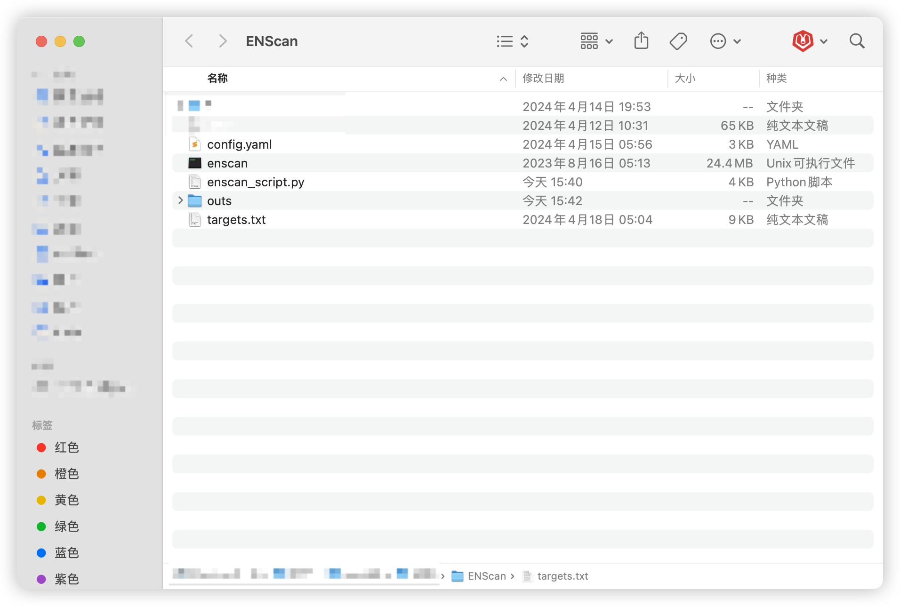
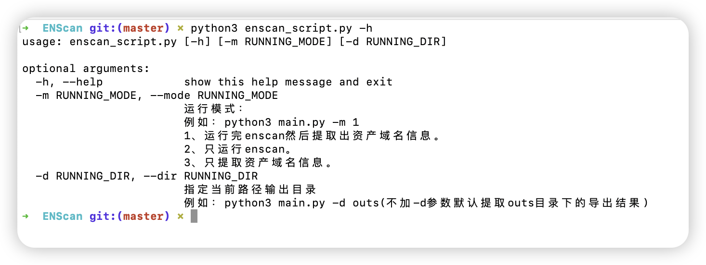
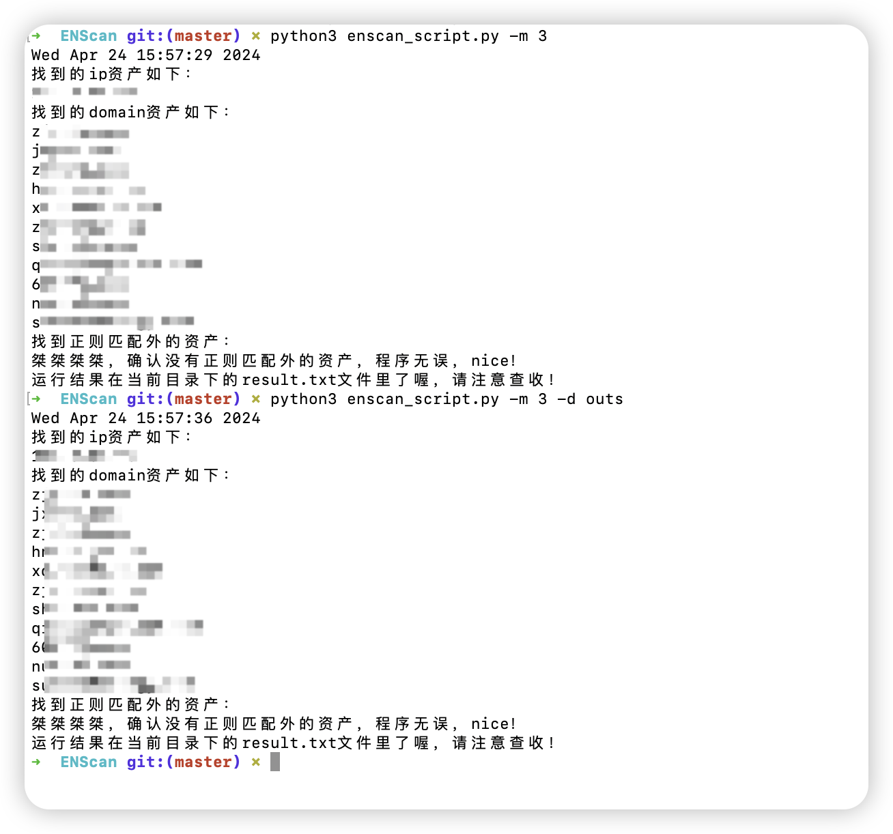

# Enscan_Script

快速筛选Enscan输出结果中的domain，让你在红蓝攻防中快人一步

## 环境配置

首先下载enscan到本地，生成配置文件，配置好需要的api，详细的配置请移步enscan_go项目

[wgpsec/ENScan_GO: 一款基于各大企业信息API的工具，解决在遇到的各种针对国内企业信息收集难题。一键收集控股公司ICP备案、APP、小程序、微信公众号等信息聚合导出。 (github.com)](https://github.com/wgpsec/ENScan_GO)

目录结构大概是这样



enscan文件命名要跟enscan_script.py中的一致，和enscan_script.py文件放置在当前目录下。

targets.txt放置的是目标资产名

## 如何使用

帮助信息

```
python3 enscan_script.py -h
```



懒得去跑enscan了，直接展示模块3吧

```
python3 enscan_script.py -m 3 -d outs
```



## 更新日志

2024.4.14	创建项目Enscan_Script。

2024.4.24	更新项目Enscan_Script，将多个py脚本整合到一个py文件中。

## 待更新内容

1、提取内容优化。

2、提取公众号名和小程序名。

3、提取结果联动扫描器一条龙服务。